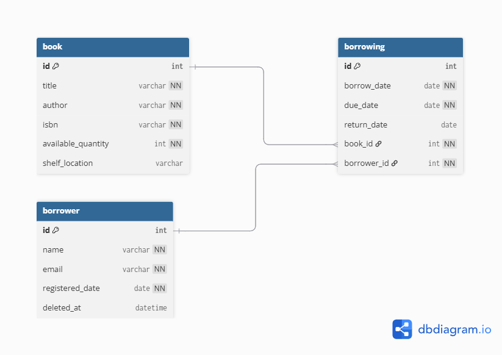

# Database Schema



## Table Definitions

### **book**

| Column               | Type      | Notes                       |
| -------------------- | --------- | --------------------------- |
| `id`                 | `int`     | Primary key, auto-increment |
| `title`              | `varchar` | Not null                    |
| `author`             | `varchar` | Not null                    |
| `isbn`               | `varchar` | Not null, unique            |
| `available_quantity` | `int`     | Not null, default `0`       |
| `shelf_location`     | `varchar` | Nullable                    |

### **borrower**

| Column            | Type       | Notes                            |
| ----------------- | ---------- | -------------------------------- |
| `id`              | `int`      | Primary key, auto-increment      |
| `name`            | `varchar`  | Not null                         |
| `email`           | `varchar`  | Not null, unique                 |
| `registered_date` | `date`     | Not null                         |
| `deleted_at`      | `datetime` | Soft-delete timestamp (nullable) |

### **borrowing**

| Column        | Type   | Notes                                            |
| ------------- | ------ | ------------------------------------------------ |
| `id`          | `int`  | Primary key, auto-increment                      |
| `borrow_date` | `date` | Not null                                         |
| `due_date`    | `date` | Not null                                         |
| `return_date` | `date` | Nullable                                         |
| `book_id`     | `int`  | Foreign key → `book.id` (ON DELETE RESTRICT)     |
| `borrower_id` | `int`  | Foreign key → `borrower.id` (ON DELETE RESTRICT) |

---

## Migrations

Keep your schema in sync with your entities by using TypeORM migrations:

1. Define or modify your `@Entity()` classes.
2. Generate a new migration:

    ```bash
    npm run migration:generate -- src/database/migrations/YourMigrationName
    ```

3. Apply migrations:

    ```bash
    npm run migration:run
    ```

4. Migration files live under `src/database/migrations/`.

5. Rollback migrations if needed:

    ```bash
    npm run migration:revert
    ```

## 📚 Additional Documentation

- [API Documentation](./docs/API.md) - Detailed API reference
